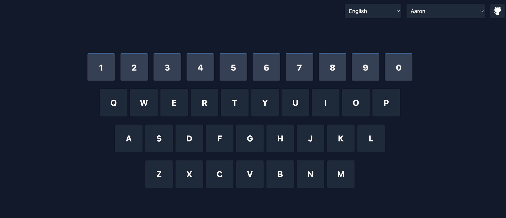

# ABC123 Speak - Fun LearningLearning Tool for Toddlers 🎯

**ABC123 Speak** is a language learning tool designed for children, helping them master the pronunciation of letters and numbers through interactive keyboard and standard human voice.

## 📸 Preview

  

## ⌨️ Live Demo

🔗 [Start Learning Now](https://abc123speak.vercel.app/)

## 👶 Target Users

- Children aged 3-6 learning alphabet and numbers in their native language
- Kids who love to tap, hit, and grab keyboards

## 🌟 Core Features

- Support for alphabet and number pronunciation in 12 languages
- Real and standard human voice pronunciation
- Standard Chinese Pinyin pronunciation
- Multiple voice style options
- Interactive keyboard with animated key presses
- Automatic browser language detection

## 🛠️ Tech Stack

- **Framework**: Nuxt 3
- **Styling**: TailwindCSS
- **Speech Synthesis**: Web Speech API

## 🌐 Browser Support

- Chrome (Recommended)
- Safari
- Edge
- Firefox

## 📝 Usage Guide

1. Open the webpage and ensure your device's sound is on
2. Select your preferred language and voice style
3. Learn through keyboard input or button clicks

## 🤝 Contributing

We welcome [Issues](https://github.com/liusheng22/abc123-speak/issues) and [Pull Requests](https://github.com/liusheng22/abc123-speak/pulls)! Your contributions and feedback are greatly appreciated.

## 📄 License

[MIT License](LICENSE)

---

[切换到中文文档](README_ZH.md)