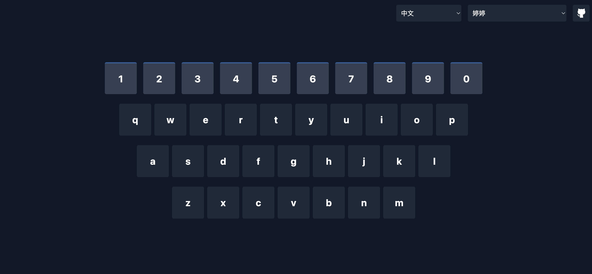

# 开口学习说 ABC123 - 幼儿好玩的发声学习工具 🎯

**ABC123 Speak** 是一款为小朋友设计的语言学习工具，通过互动键盘和真人标准发音，帮助孩子快乐掌握字母表、数字的读音。

## 📸 效果预览

  

## ⌨️ 在线演示

🔗 [体验一下吧～](https://abc123speak.vercel.app/)

## 👶 适用人群

- 3-6岁正在学习母语的字母表和数字的小朋友们
- 总是喜欢敲击、拍打、抢夺键盘的小朋友们

## 🌟 核心功能

- 支持12种语言的字母表和数字的发音
- 真实且标准的人声发音
- 标准的汉语拼音发音
- 多种人物发音风格可选择
- 互动式键盘交互按键动画
- 浏览器语言自动检测

## 🛠️ 技术栈

- **框架**: Nuxt 3
- **样式**: TailwindCSS
- **语音合成**: Web Speech API

## 🌐 浏览器支持

- Chrome (推荐)
- Safari
- Edge
- Firefox

## 📝 使用说明

1. 打开网页，确保设备声音开启
2. 选择学习的语言和人物发音风格
3. 通过键盘输入或点击按键即可学习

## 🤝 贡献指南

欢迎提交 [Issue](https://github.com/liusheng22/abc123-speak/issues) 和 [Pull Request](https://github.com/liusheng22/abc123-speak/pulls)！期待您的贡献和反馈。

## 📄 开源协议

[MIT License](LICENSE)

---

[Switch to English Documentation](README.md)